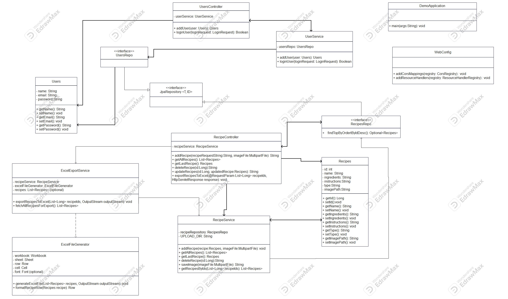

# RIS PROJECT
The Recipes Application is a web-based platform designed for users to share and explore various recipes. Users can create an account, log in, and manage their own recipes, including adding photos, editing existing recipes, and deleting them when needed. 

# About project

## Main functionalities
- User Registration and Login: Users must first register by creating an account before they can add or view recipes.

- Recipe Management: Users can add new recipes with photos, modify existing recipes, and delete recipes if needed.

- Recipe Display: Users can browse a collection of recipes, view details about each recipe, and use them for cooking.

## Technology Stack

- Backend:
  - Framework: Spring Boot
  - Database: MySQL

- Frontend:
  - Framework: React

- Development Environment: Visual Studio Code (VS Code)

## Project structure

- backend/: Contains the Spring Boot project that handles user authentication, recipe management, and database interactions.

- frontend/: Contains the React app responsible for rendering the UI and interacting with the backend API.

- database: Holds the MySQL database configuration files.

- README.md: This file that contains documentation for developers.

## Required Apps

Before you begin, it's recommended to have the following applications and tools:

- **Java**
- **Spring Boot**
- **React**
- **Node.js**
- **Postman**
- **MySQL**

## Development environments

- Visual Studio Code (recommended IDE for frontend)
- IntelliJ IDEA (recommended IDE for backend)
- any other IDE

## Installation Instructions
- Clone the Repository

   - git clone https://github.com/milla77905/Recepti.git
   - cd recepti

## Install Backend Dependencies: 
- Use Maven to install the dependencies:

     - ./mvnw install

## Run the Backend: 
- Start the Spring Boot application:

     - ./mvnw spring-boot:run

## Frontend Setup (React)
 
   - cd frontend
   - npm install
   - npm start

## Access the Application
  
  - backend:
     - http://localhost:8080

  - frontend:
    - http://localhost:3000

## Coding Standards

- **Java:**
    - Follow standard Java naming conventions (camelCase for variables and methods, PascalCase for classes).
    - Ensure proper indentation and comment code where necessary.
    - Consider using tools like Checkstyle for enforcing coding standards.

- **React:**
    - Use functional components and hooks, and maintain a clear structure for your components.
    - Ensure that JSX is properly formatted.
    - Utilize PropTypes or TypeScript for type checking.

## Class Diagram

  

## Class Diagram Description

### Class: Users
|   |    |                                                                                          |
|--------------|--------|------------------------------------------------------------------------------------------|
| **Role** |  Represents the user entity with basic attributes: name, email, and password.          |
| **Methods** | - getName(), getEmail(), getPassword(): Return the corresponding attribute values.   - setName(), setEmail(), setPassword(): Set the values of the attributes. |
| **Purpose** | Stores user data for registration and login functionality. |
|   |    |                                                                                          |

### Class: UsersController
|   |    |                                                                                          |
|--------------|--------|------------------------------------------------------------------------------------------|
| **Role** |  Controller class that provides APIs for user-related actions.          |
| **Methods** | - addUser(Users user): Adds a new user.   - loginUser(LoginRequest loginRequest): Validates user login. |
| **Purpose** | Links user requests (e.g., registration and login) to the backend services. |
|   |    |                                                                                          |

### Class: UsersRepo
|   |    |                                                                                          |
|--------------|--------|------------------------------------------------------------------------------------------|
| **Role** |   Interface for the data layer, leveraging JPA to interact with the user entity.          |
| **Methods** | - Inherits methods from JpaRepository. |
| **Purpose** | Allows saving, retrieving, and managing user data in the database. |
|   |    |                                                                                          |

### Class: UserService
|   |    |                                                                                          |
|--------------|--------|------------------------------------------------------------------------------------------|
| **Role** |  Service layer class for user-related business logic.          |
| **Methods** | - addUser(Users user): Adds a new user by calling the repository to persist user data.   - loginUser(LoginRequest loginRequest): Validates user credentials against the data stored in the database. |
| **Purpose** | Encapsulates the business logic for handling user registration and login, ensuring the controller remains focused on handling API requests. |
|   |    |                                                                                          |

### Class: RecipeController
|   |    |                                                                                          |
|--------------|--------|------------------------------------------------------------------------------------------|
| **Role** |  Controller class for APIs related to recipes.          |
| **Methods** | - addRecipe(String recipeRequest, MultipartFile imageFile): Adds a new recipe with an optional image.   - getAllRecipes(): Retrieves a list of all recipes.   - getRecipe(Long id): Retrieves a specific recipe by ID.   - deleteRecipe(Long id): Deletes a recipe by ID.   - updateRecipes(Long id, Recipes updatedRecipe): Updates an existing recipe.   - exportRecipesToExcel(@RequestParam List<Long> recipeIds, HttpServletResponse response) - The endpoint for exporting recipes to an Excel file. |
| **Purpose** | Processes user requests and forwards them to appropriate services for recipe management. |
|   |    |                                                                                          |

### Class: RecipeService
|   |    |                                                                                          |
|--------------|--------|------------------------------------------------------------------------------------------|
| **Role** |  Contains the business logic for managing recipes.          |
| **Methods** | - addRecipe(Recipes recipe, MultipartFile imageFile): Handles the logic for adding a new recipe.   - getAllRecipes(): Retrieves all recipes from the database.   - getRecipe(Long id): Retrieves a specific recipe.   - saveImage(MultipartFile imageFile): Saves the recipe image.   - getRecipesByIds(List<Long> recipeIds): List<Recipes> - Fetches recipes from the repository by their IDs. |
| **Purpose** | Manages the data and logic for recipe operations. |
|   |    |                                                                                          |

### Class: Recipes
|   |    |                                                                                          |
|--------------|--------|------------------------------------------------------------------------------------------|
| **Role** |  Represents the recipe entity with attributes like name, ingredients, instructions, type, and image path.          |
| **Methods** | - getId(), getName(), getIngredients(), getInstructions(), getImagePath(): Return the corresponding attribute values.   - setId(), setName(), setIngredients(), setInstructions(), setImagePath(): Set the values of the attributes. |
| **Purpose** | Defines the data structure for recipes. |
|   |    |                                                                                          |

### Class: RecipesRepo
|   |    |                                                                                          |
|--------------|--------|------------------------------------------------------------------------------------------|
| **Role** |  Interface for the data layer to interact with the recipe entity.          |
| **Methods** | - findTopByOrderByIdDesc(): Finds the most recently added recipe. |
| **Purpose** | Enables interaction with the recipe database. |
|   |    |                                                                                          |

### Class: ExcelExportService
|   |    |                                                                                          |
|--------------|--------|------------------------------------------------------------------------------------------|
| **Role** |  Acts as an intermediary service that retrieves recipe data and delegates the Excel file generation to the ExcelFileGenerator. It ensures that the process of exporting recipes to Excel is handled smoothly.          |
| **Methods** | - exportRecipesToExcel(List<Long> recipeIds, OutputStream outputStream): Exports selected recipes to an Excel file.   - fetchAllRecipesForExport(): Retrieves all recipes if "Export All" is selected. |
| **Purpose** | Provides the functionality to generate an Excel file containing selected recipes. It acts as a bridge between the controller (handling user requests) and the logic for generating Excel files. |
|   |    |    

### Class: ExcelFileGenerator
|   |    |                                                                                          |
|--------------|--------|------------------------------------------------------------------------------------------|
| **Role** |  Handles the low-level details of creating and formatting the Excel file. It uses libraries like Apache POI to create sheets, rows, and cells for the data.          |
| **Methods** | - generateExcelFile(List<Recipes> recipes, OutputStream outputStream): Generates an Excel file and writes it to the given output stream.   - formatRecipeRow(Recipes recipe): Formats a single recipe as a row in the Excel sheet. |
| **Purpose** | Encapsulates the logic of creating and formatting an Excel file from the recipe data. It ensures that the data is properly structured and displayed in the Excel file. |
|   |    |  

### Class: JpaRepository<T, ID>
|   |    |                                                                                          |
|--------------|--------|------------------------------------------------------------------------------------------|
| **Role** |  Generic Spring Data JPA interface that provides CRUD operations for entities.          |
| **Purpose** | Acts as a base interface for UsersRepo and RecipesRepo, enabling database operations without requiring custom query definitions. |
|   |    |                                                                                          |

### Class: WebConfig
|   |    |                                                                                          |
|--------------|--------|------------------------------------------------------------------------------------------|
| **Role** |  Configuration class for the web application.          |
| **Methods** | - addCorsMappings(CorsRegistry registry): Configures Cross-Origin Resource Sharing (CORS).   - addResourceHandlers(ResourceHandlerRegistry registry): Adds resources like images. |
| **Purpose** | Sets up basic configurations for the application. |
|   |    |                                                                                          |

### Class: DemoApplication
|   |    |                                                                                          |
|--------------|--------|------------------------------------------------------------------------------------------|
| **Role** |  Entry point of the application.          |
| **Methods** | - main(String[] args): Starts the application. |
| **Purpose** | Launches the Spring Boot application. |
|   |    |                                                                                          |

### Key Methods for Functionality
|   |    |                                                                                          |
|--------------|--------|------------------------------------------------------------------------------------------|
| **addUser() (UsersController, UserService)** |  Registers a new user by validating and saving their data. |
| **loginUser() (UsersController, UserService)** | Authenticates a user by checking credentials against stored data. |
| **addRecipe() (RecipeController, RecipeService)** |  Handles the logic for adding recipes and their images.          |
| **getAllRecipes() (RecipeController, RecipeService)** |  Fetches a list of all recipes. |
| **fetchAllRecipesForExport() (ExcelExportService)** |  Fetches a list of selected recipes. |
| **exportRecipesToExcel() (ExcelExportService)** |  Export a list of selected recipes into an excel file. |
| **generateExcelFile() (ExcelFileGenerator)** |  Generate excel file and insert a list of selected recipes. |
|   |    |                                                                                          |

 ## License

    Recipes® ©2024 All rights reserved
