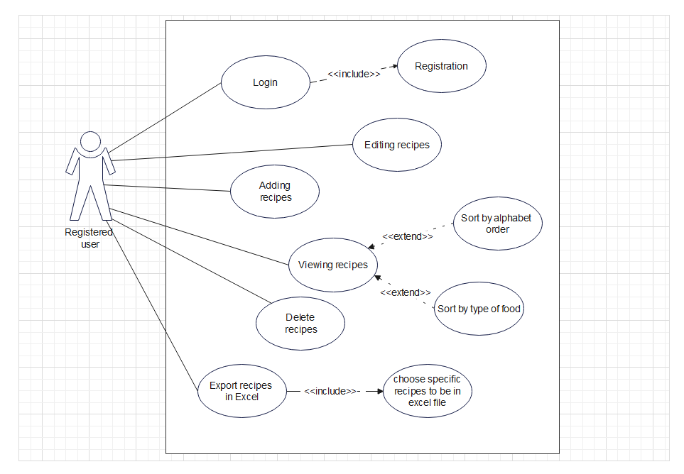

# Project vision:

The purpose of the app is to save, post and share the recipes and to organise people's own recipes. It's easier for users to find the recipes because of the images and the sorting system. Overall, this app serves as a convenient and user-friendly tool for culinary enthusiasts to create, share, and discover delicious recipes in an organized manner.

# Glossary

| Term          | Description                                                                                                 |
|---------------|-------------------------------------------------------------------------------------------------------------|
| recipe        | It’s a collection of ingredients, instructions, title, type of food, image.                                 |
| ingredients   | The text or list of things to add.                                                                          |
| instructions  | The text or list of things to do.                                                                           |
| type of food  | The foods can be of various types: bakery, meals, desserts. The user can sort by food type.                 |
| sorting       | The sorting is possible by: 1. alphabetical order, 2. food type.                                            |

or you can open this excel document [Glossary.xlsx](assets/Glossary.xlsx)

# DPU 

## Explanation

- **Actors as Characters**: The actors (Registered and Unregistered users) are represented by icons for clarity.
- **Use Cases**: Each use case (e.g., "Add Recipe", "Login") describes a specific action available to the actor.
- **Includes and Extends**: Use `<<include>>` and `<<extend>>` for additional features related to a primary use case. For example, "Sort Recipes" extends to "Alphabetical Order" and "By Food Type."

